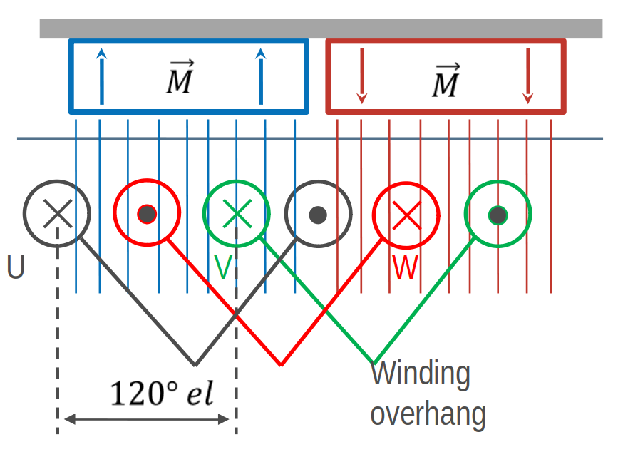
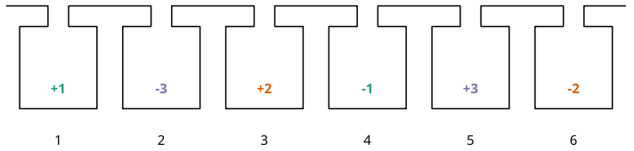

Basic usage
===========

Simple overlapping winding
--------------------------

For the beginning let's have a look how we can collect magnetic flux 
generated by a permanent-magnet rotor through a coil. The highest
flux we get, if we define the coil width :math:`W` equal to the
pole pitch :math:`\tau_p`. However this in practise this often isn't 
the best choise because of the high harmonic content. Most windings 
have :math:`W < \tau_p`.

.. figure:: fig/winding_sketch.png
    :width: 400
    :alt: Alternative text
    :figclass: align-center

    How to get flux, based on the rotor, through a coil

For a symmetric three-phase winding we have to add two more coil
which are shifted by 120°. For two poles this is one of the most
simplest winding.

    Overlapping winding with 6 slots, 2 poles and 3 phases

Let's have a look how we can model this simple winding with swat-em.
First of all we need to import swat-em. The relevant part is the
datamodel() object. It includes all data and methods for the winding: 

.. code-block:: python

    from swat_em import datamodel

The model has an built-in winding generator for almost every winding
for rotating field motors such as permanent-magnet, synchronous or
induction machines:

.. code-block:: python

    >>> data = datamodel()      # generate a datamodel for the winding
    >>> Q = 6                   # number of slots
    >>> P = 2                   # number of pole pairs
    >>> data.genwdg(Q = Q, P = P, m = 3, layers = 1)
    >>> print(data)             # print infos for the winding
    WINDING DATAMODEL
    =================

    Title: Untitled
    Number of slots:  6
    Number of poles:  2
    Number of phases: 3
    Number of layers: 1
    Winding step    : 3
    Number of slots per pole per phase: 1
    Fundamental winding factor: 1.0, 1.0, 1.0

    Generated overlapping winding

Simple tooth-coil winding
--------------------------

Besides of the overlapping winding there is another winding winding
systems - tooth coils. To get such a winding the winding step 
must be exactely :math:`W=1`. This means, that the distance between a
wire and its reverse wire is one slot.

simplest winding.

.. figure:: fig/winding_sketch_toothcoils.png
    :width: 300
    :alt: Alternative text
    :figclass: align-center

    Tooth-coil winding with 3 slots, 2 poles and 3 phases

We can set the winding step explicite with the keyword 'stepwidth'. 
Compared to the overlapping winding we need only 3 slots for
the two poles. To get a coil around every tooth, we need two 
winding layers:

.. code-block:: python

    >>> data = datamodel()      # generate a datamodel for the winding
    >>> Q = 3                   # number of slots
    >>> P = 2                   # number of pole pairs
    >>> w = 1                   # step width for the coil in slots

    >>> # generate winding automatically
    >>> data.genwdg(Q = Q, P = P, m = 3, layers = 2, w = w) 
    >>> print(data)             # print infos for the winding
    WINDING DATAMODEL
    =================

    Title: Untitled
    Number of slots:  3
    Number of poles:  2
    Number of phases: 3
    Number of layers: 1
    Winding step    : 1
    Number of slots per pole per phase: 1/2
    Fundamental winding factor: 0.866, 0.866, 0.866

A more complex winding
----------------------
A more complex winding (overlapping full pitch winding with coil shortening)

.. code-block:: python

    >>> data = datamodel()
    >>> Q = 12
    >>> P = 2
    >>> w = 5     # without shortening w would be 6 for this winding
    >>> data.genwdg(Q = Q, P = P, m = 3, layers = 2, w = w) 
    >>> print(data)
    WINDING DATAMODEL
    =================

    Title: Untitled
    Number of slots:  12
    Number of poles:  2
    Number of phases: 3
    Number of layers: 2
    Winding step    : 5
    Number of slots per pole per phase: 2
    Fundamental winding factor: 0.933, 0.933, 0.933

