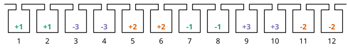
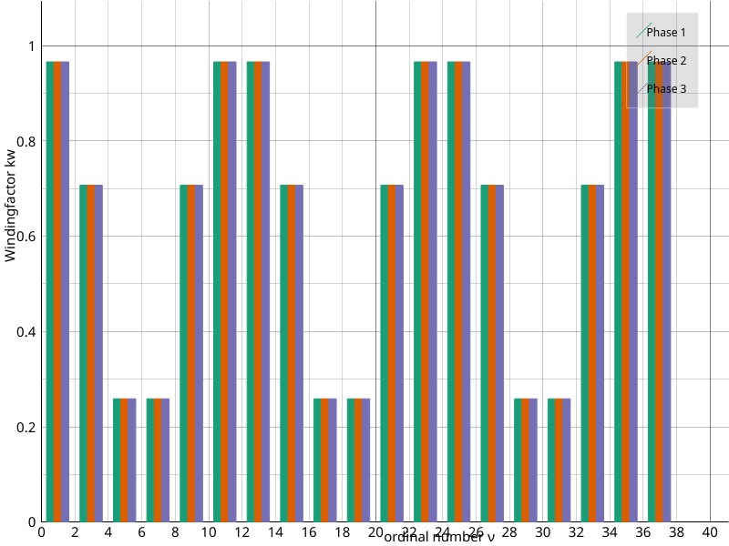
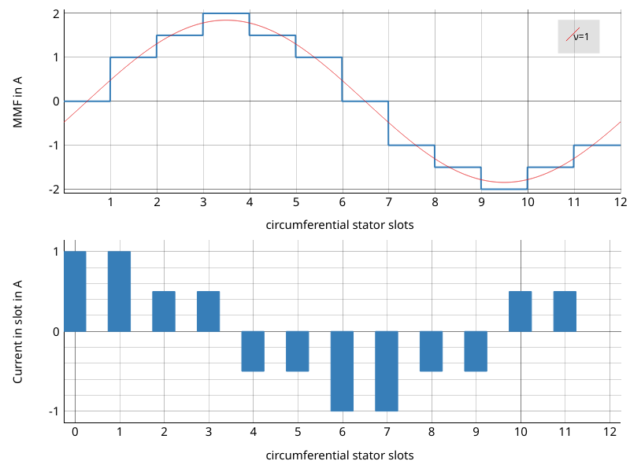

Plots
=====

Winding layout
--------------

SWAT-EM provides some possibilities for graphical representations.
After creating a winding one would like to have a look on the layout,
for example. This plot includes all coil sides of all phases in the slots:

.. code-block:: python

    >>> wdg = datamodel()
    >>> wdg.genwdg(Q = 12, P = 2, m = 3, layers = 1) 
    >>> wdg.plot_layout('plot_layout.png')

    Plot of the winding layout

Voltage phasors of the star of slot
-----------------------------------

SWAT-EM calculates the winding factor by the slot voltage phasors. 
The following is the corresponding visualization.

.. code-block:: python

    >>> wdg.plot_star('plot_star.png')

.. figure:: fig/plot_star.png
    :width: 600
    :alt: voltage phasors plot
    :figclass: align-center

    Plot of the voltage phasors

Winding factor
--------------

For the winding factor one have to decide between the mechanical or 
the electrical winding factor. Attention: For a 2-pole machine
the electrical and mechanical winding factor is equal.

.. code-block:: python

    >>> wdg.plot_windingfactor('plot_wf.png', mechanical = False)

    Plot of the electrical winding factor

Magnetomotive force
-------------------

The winding generates a current linkage in the slots. The 
integral of it leads to a magnetic field in the airgap, which 
is called the 'Magnetomotive force (MMF)'. It's a good indicator
for the harmonic content of the winding.
Also the resultion of the image can be definded:

.. code-block:: python

    >>> wdg.plot_MMK('plot_MMK.png', res = [800, 600], phase = 0)

    Plot of the current linkage in the slots and the resulting 
    Magnetomotove force

It also could be usefull to plot at different phase angles

.. code-block:: python

    >>> wdg.plot_MMK('plot_MMK_20deg.png', res = [800, 600], phase = 20)

.. figure:: fig/plot_MMK_20deg.png
    :width: 600
    :alt: magnetomotive force
    :figclass: align-center

    Plot of the current linkage in the slots and the resulting 
    Magnetomotove force with phaseangle = 20°.

