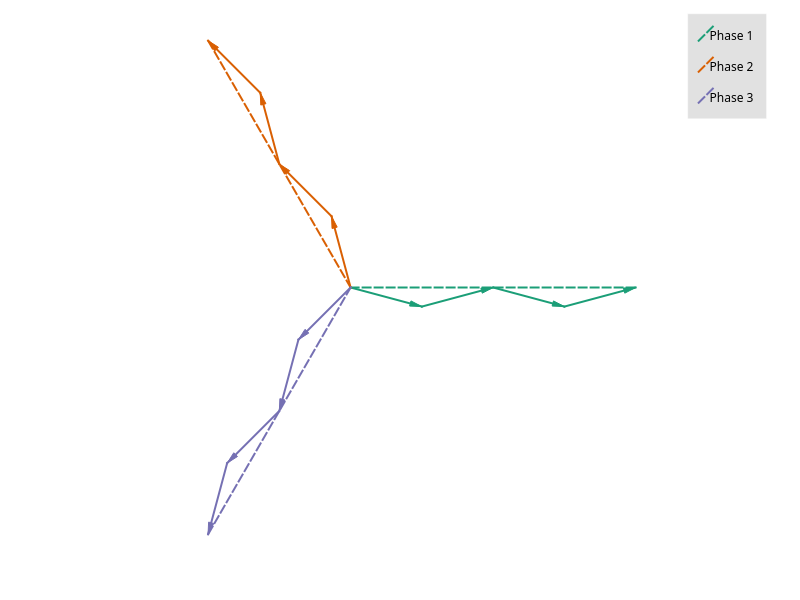
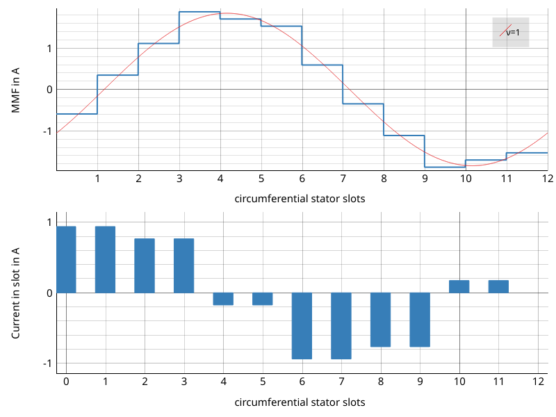

#############
Using the api
#############

***********
Basic usage
***********

Simple overlapping winding
==========================

In the theory section the following simple winding was shown.

.. figure:: fig/overlapping_6_2.png
    :width: 500
    :alt: Alternative text
    :figclass: align-center

    Overlapping winding with 6 slots and 2 poles and 3 phases

Let's have a look how we can model this with swat-em.
First of all we need to import swat-em. The relevant part is the
datamodel() object. It includes all data and methods for the winding: 

.. code-block:: python

    from swat_em import datamodel

The model has an built-in winding generator for almost every winding
for rotating field motors such as permanent-magnet, synchronous or
induction machines:

.. code-block:: python

    >>> wdg = datamodel()      # generate a datamodel for the winding
    >>> Q = 6                   # number of slots
    >>> P = 2                   # number of pole pairs
    >>> wdg.genwdg(Q = Q, P = P, m = 3, layers = 1)
    >>> print(wdg)             # print infos for the winding
    WINDING DATAMODEL
    =================

    Title: Untitled
    Number of slots:  6
    Number of poles:  2
    Number of phases: 3
    Number of layers: 1
    Winding step    : 3
    Number of slots per pole per phase: 1
    Fundamental winding factor: 1.0, 1.0, 1.0

Simple tooth-coil winding
=========================

In the same way we can create a tooth-coil winding

.. figure:: fig/toothcoil_3_2.png
    :alt: Alternative text
    :figclass: align-center

    Winding layout with 3 slots, 2 poles and 3 phases

We can set the winding step explicite with the keyword 'stepwidth'. 
Compared to the overlapping winding we need only 3 slots for
the two poles. To get a coil around every tooth, we need two 
winding layers:

.. code-block:: python

    >>> wdg = datamodel()      # generate a datamodel for the winding
    >>> Q = 3                   # number of slots
    >>> P = 2                   # number of pole pairs
    >>> w = 1                   # step width for the coil in slots

    >>> # generate winding automatically
    >>> wdg.genwdg(Q = Q, P = P, m = 3, layers = 2, w = w) 
    >>> print(wdg)             # print infos for the winding
    WINDING DATAMODEL
    =================

    Title: Untitled
    Number of slots:  3
    Number of poles:  2
    Number of phases: 3
    Number of layers: 1
    Winding step    : 1
    Number of slots per pole per phase: 1/2
    Fundamental winding factor: 0.866, 0.866, 0.866

A more complex winding
======================
A more complex winding (overlapping full pitch winding with coil shortening)

.. figure:: fig/overlapping_12_2.png
    :alt: Alternative text
    :figclass: align-center

    Winding layout with 12 slots, 2 poles and 3 phases

.. code-block:: python

    >>> wdg = datamodel()
    >>> Q = 12
    >>> P = 2
    >>> w = 5     # without shortening w would be 6 for this winding
    >>> wdg.genwdg(Q = Q, P = P, m = 3, layers = 2, w = w) 
    >>> print(wdg)
    WINDING DATAMODEL
    =================

    Title: Untitled
    Number of slots:  12
    Number of poles:  2
    Number of phases: 3
    Number of layers: 2
    Winding step    : 5
    Number of slots per pole per phase: 2
    Fundamental winding factor: 0.933, 0.933, 0.933

*******
Results
*******

Getting Results
===============
After generating a winding, swat-em analyze it and provides the results:

.. code-block:: python

    >>> wdg = datamodel()
    >>> wdg.genwdg(Q = 12, P = 2, m = 3, layers = 1) 
    >>> print('fundamental winding factor: ', wdg.get_fundamental_windingfactor())
    fundamental winding factor:  [0.9659258262890683, 0.9659258262890683, 0.9659258262890684]
    >>> print('winding step: ', wdg.get_windingstep())
    winding step:  6

Get the generated winding layout:
For each phase there is a list of the 1st and 
the 2nd layer. In this example there is only 1 layer, so the second
list is empty. An entry of the lists define the slot number in which
is a coil-side of the phase is located. A negative number means, that 
the winding direction is reversed in the slot.

.. code-block:: python

    >>> print('winding layout:', wdg.get_phases())
    winding layout: [[[1, 2, -7, -8], []], [[5, 6, -11, -12], []], [[-3, -4, 9, 10], []]]

The winding factor depends on the harmonic number. There are two 
possible interpretations for the harmonic number: The 'electrical'
harmonic numbers the 'mechanical' ordinal numbers multiplyed with
number of pole pairs 'p'. Use the 'mechanical' winding factor if you
want du determine the possible number of poles your winding can drive
and use the electrical winding factor if you know your number of pole
pairs and if you want to analyze the harmonic content of the winding
for example.
Attention: The winding factor is calculated for each phase seperately.

.. code-block:: python

    >>> nu, kw = wdg.get_windingfactor_el()
    >>> for k in range(len(nu)):
    >>>     print(nu[k], kw[k])
    1 [0.96592583 0.96592583 0.96592583]
    3 [-0.70710678 -0.70710678 -0.70710678]
    5 [-0.25881905 -0.25881905 -0.25881905]
    7 [0.25881905 0.25881905 0.25881905]
    9 [-0.70710678 -0.70710678 -0.70710678]
    ...

The datamodel() object stores the data in dictionaries. The user 
have direct access:

.. code-block:: python

    >>> print('Data for the machine: ', wdg.machinedata.keys())
    Data for the machine:  dict_keys(['Q', 'p', 'm', 'phases', 'wstep', 'turns', 'phasenames'])
    >>> # ... and all results:
    >>> print('Data for the machine: ', wdg.results.keys())
    Data for the machine:  dict_keys(['q', 'nu_el', 'Ei_el', 'kw_el', 'phaseangle_el', 'nu_mech', 'Ei_mech', 'kw_mech', 'phaseangle_mech', 'valid', 'error', 't', 'wdg_is_symmetric', 'wdg_periodic', 'MMK', 'basic_char'])

For getting the results the get_* methods can be used:

.. code-block:: python

    >>> print('Is winding symmetric:', wdg.get_is_symmetric())
    Is winding symmetric: True
    >>> print('Fundamental winding factor:', wdg.get_fundamental_windingfactor())
    Fundamental winding factor: [0.9659258262890683, 0.9659258262890683, 0.9659258262890684]
    >>> print('Number of turns in series:', wdg.get_num_series_turns())
    Number of turns in series: 2.0
    >>> print('Excited radial force modes:', wdg.get_radial_force_modes())
    Excited radial force modes: [2, 4, 6]
    >>> print('Periodictiy:', wdg.get_periodicity_t())
    Periodictiy: 1
    >>> print('Possible parallel connections:', wdg.get_parallel_connections())
    Possible parallel connections: [1, 2]
    >>> print('Double linked leakage:', wdg.get_double_linked_leakage())
    Double linked leakage: 0.02843683350047214

********
Plotting
********

Winding layout
==============

SWAT-EM provides some possibilities for graphical representations.
After creating a winding one would like to have a look on the layout,
for example. This plot includes all coil sides of all phases in the slots:

.. code-block:: python

    >>> wdg = datamodel()
    >>> wdg.genwdg(Q = 12, P = 2, m = 3, layers = 1) 
    >>> wdg.plot_layout('plot_layout.png')

.. figure:: fig/plot_layout.png
    :width: 600
    :alt: Winding layout plot
    :figclass: align-center

    Plot of the winding layout

Voltage phasors of the star of slot
===================================

SWAT-EM calculates the winding factor by the slot voltage phasors. 
The following is the corresponding visualization.

.. code-block:: python

    >>> wdg.plot_star('plot_star.png')

    Plot of the voltage phasors

Winding factor
==============

For the winding factor one have to decide between the mechanical or 
the electrical winding factor. Attention: For a 2-pole machine
the electrical and mechanical winding factor is equal.

.. code-block:: python

    >>> wdg.plot_windingfactor('plot_wf.png', mechanical = False)

.. figure:: fig/plot_wf.png
    :width: 600
    :alt: el. winding factor plot
    :figclass: align-center

    Plot of the electrical winding factor

Magnetomotive force
===================

The winding generates a current linkage in the slots. The 
integral of it leads to a magnetic field in the airgap, which 
is called the 'Magnetomotive force (MMF)'. It's a good indicator
for the harmonic content of the winding.
Also the resultion of the image can be definded:

.. code-block:: python

    >>> wdg.plot_MMK('plot_MMK.png', res = [800, 600], phase = 0)

.. figure:: fig/plot_MMK.png
    :width: 600
    :alt: magnetomotive force
    :figclass: align-center

    Plot of the current linkage in the slots and the resulting 
    Magnetomotove force

It also could be usefull to plot at different phase angles

.. code-block:: python

    >>> wdg.plot_MMK('plot_MMK_20deg.png', res = [800, 600], phase = 20)

    Plot of the current linkage in the slots and the resulting 
    Magnetomotove force with phaseangle = 20°.

*******
File IO
*******

Save/load a winding
===================

After creating a winding we can save it as a \*.wdg file
This file can be used with the GUI for example.
swat-em uses the "json" format for the \*.wdg files.

.. code-block:: python

    >>> wdg = datamodel()
    >>> wdg.genwdg(Q = 12, P = 2, m = 3, layers = 1) 
    >>> wdg.save_to_file('myfile.wdg')

We can also load an existing winding from file:

.. code-block:: python

    >>> wdg2 = datamodel()

Proof, that the data of the two objects is equal:

.. code-block:: python

    >>> print('same data?:', wdg.machinedata == wdg2.machinedata)
    same data?: True
    >>> print('same results?:', wdg.results == wdg2.results)
    same results?: True

Export to Excel file
====================

The data of an existing winding can exported to an Excel file (\*.xlsx).
Attention: The old \*.xls format is not supported!

.. code-block:: python

    >>> wdg.export_xlsx('export.xlsx')

Text report
===========

A summary of the winding can be exported as a text report:

.. code-block:: python

    >>> wdg.export_text_report('report.txt')

HTML report
===========

Similar to the text report we can create a html report. 
This also includes the graphics.

.. code-block:: python

    >>> wdg.export_html_report('report.html')

