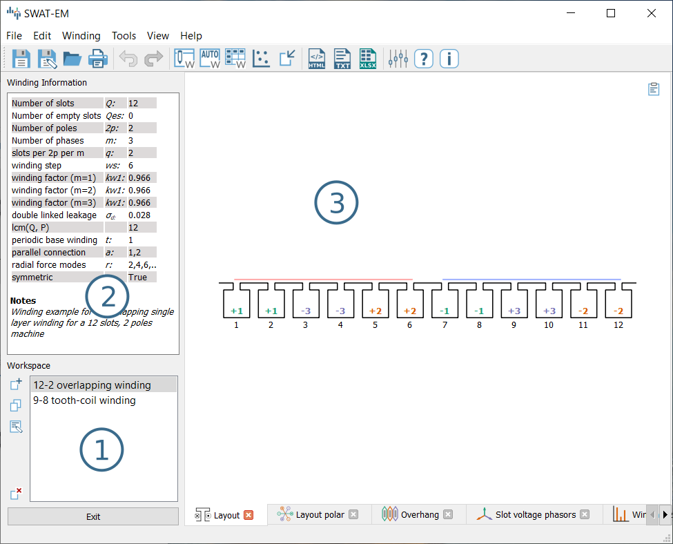
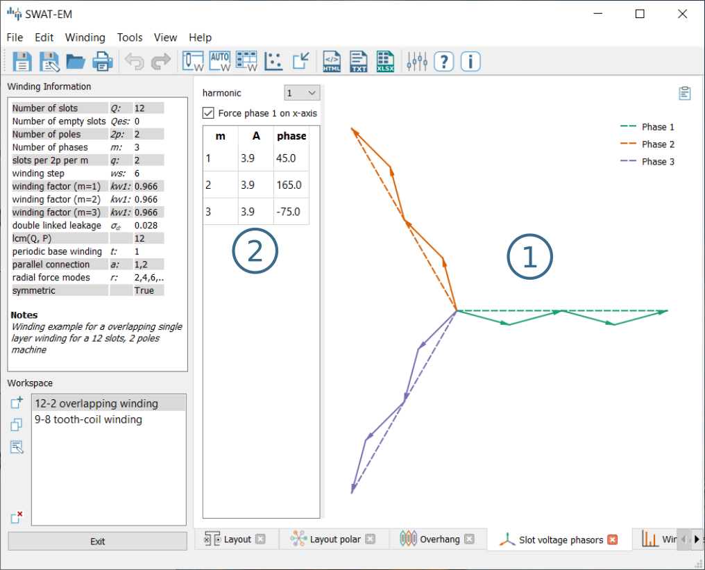
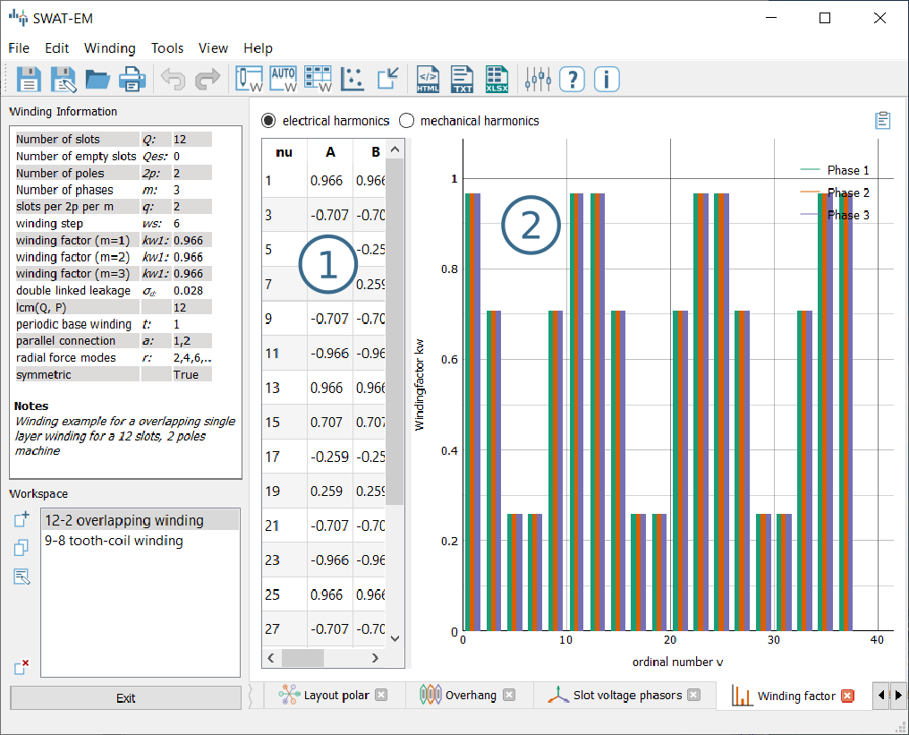
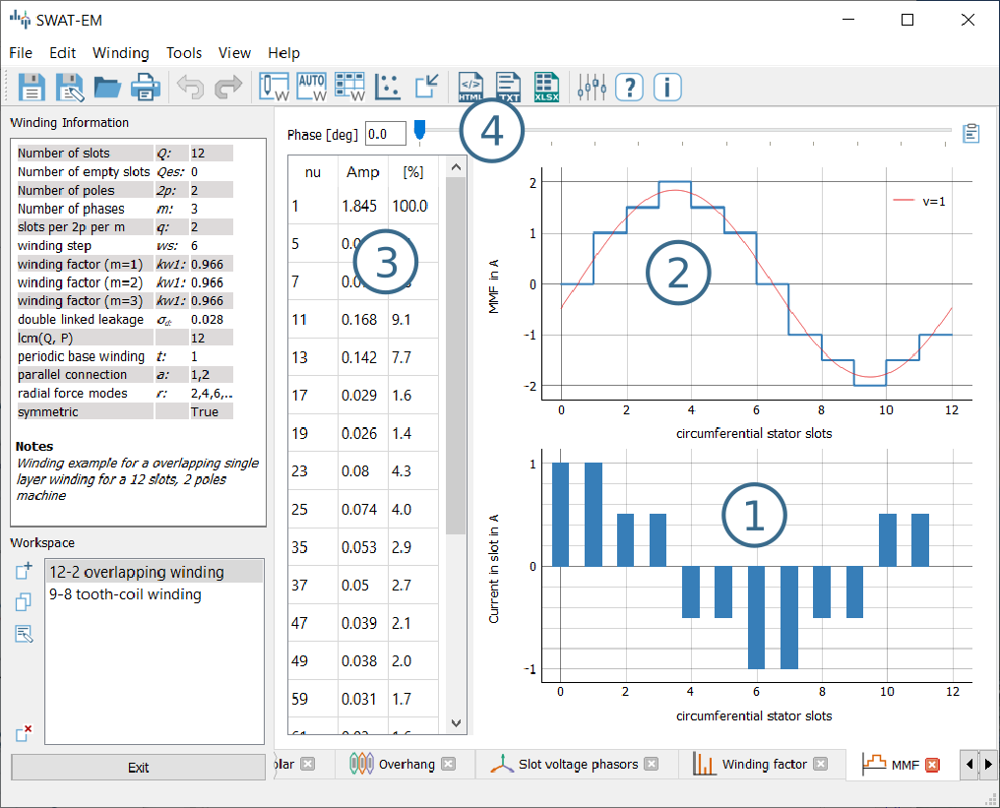
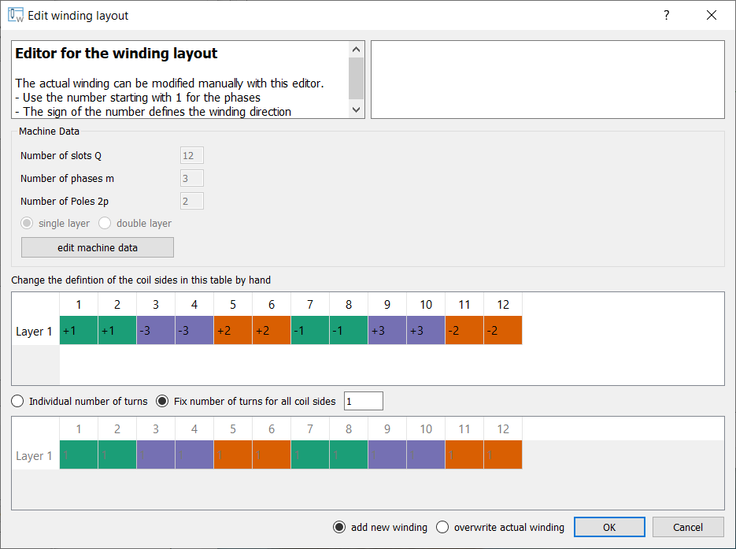
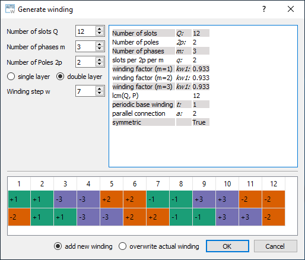
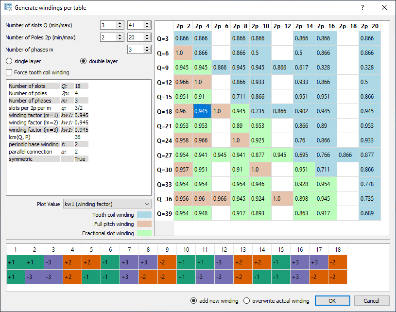

##################################
Using the graphical user interface
##################################

SWAT-EM comes with an QT based graphical user interface (GUI). The layout of the main window consists of the

- Workspace (1)
- Winding information's (2)
- Graphical analysis and report (3)

.. _fig:mainwindow:

    Main-window

.. _sec:workspace:

Workspace
=========

A SWAT-EM project, that can be saved as \*.wdg file can contain several different windings system. So, one can define and compare these windings in the same window. The workspace shows all the windings of the project. By clicking of the name all outputs (text and plots) gets updated. The buttons on the left of (1) in figure (:ref:`fig:mainwindow`) modifies the windings in the workspace

New winding
    Opens a dialog with all existing winding generator (see section :ref:`winding generators<sec:winding_generators>`). One can choose any of these generators to create a winding layout.

Manual winding layout
    Define the position of all coil sides by hand. (Not very comfortable but full control)

Auto winding layout
    Generates the winding automatically by number of slots, poles, ... (easy to use, almost every symmetric winding is possible)

Winding table
    Shows table slot/pole combinations (a good overview of possible combinations)

Notes
    If there a many windings in the project it might be a good idea to add some notes to the different layouts.

Clone
    For modifying windings one can clone/duplicate an existing one. So a switch-back to the initial state and a comparison is possible.

Delete
    Deletes the selected winding.

While saving the project to file (File :math:`\rightarrow` save) all windings of the workspace are saved. 
**Note:** Renaming of windings is possible by double-click or by pressing F2 on keyboard.

Winding information
===================

The text field (2) in figure (:ref:`fig:mainwindow`) shows a summary of actual winding. 

:math:`Q`
    Number of stator slots

:math:`2p`
    Number of poles

:math:`m`
    Number of phases

:math:`q`
    Number of slots per pole per phase :math:`q=\frac{Q}{2pm}`

:math:`kw1`
    Fundamental winding factor (for separate for each phase)

:math:`\sigma_d`
    Double linked leakage (based on MMF)

:math:`lcm(Q,P)`
    Least common multiplier of number of slots an pole pairs. For permanent-magnet machines this is the first harmonic  number of the cogging torque

:math:`t`
    Periodicity of the base winding :math:`t = gcd(Q, p)`.

:math:`a`
    Number of possible parallel winding circuit. (In most cases a is equal to t)

:math:`symmetric`
    True, if all phases are identically and shifted by a constant angle

:math:`Notes`
    User defined description

Plotting
=================
Many analyzing function results in plots which are shown on(3) in figure (:ref:`fig:mainwindow`). Every plot has a toolbar on the bottom for zooming, panning and saving the figure to file.

Winding layout
--------------

The winding layout plot shows sketched slots and coil sides. The number and color defines the number of phase the coil side belongs to. The sign (+ or -) defines the winding direction (+ means that the wire goes into the plain and - out of the plain)

Slot voltage phasors
--------------------

The impact of the coils can be represented by the star of slot. The theory behind this is described in \cite{mueller1996berechnung} for example. Every coil side :math:`S_i` gets a phasor assigned with the angle 

.. math:: \alpha_i = \dfrac{2p \pi S_i}{Q}
    :label: eq:phasors_angle2

The angle of the phasors can also be determined for the harmonics by adding the electrical ordinal number :math:`\nu_{el}`

.. math:: \alpha_{i,\nu} = \dfrac{2\nu p \pi S_i}{Q}

with :math:`p` pole pairs and the number of stator slots :math:`Q`. If the coil side has a negative winding direction :math:`\pi` is added to :math:`alpha_i` (turning down the phasor). With this the phasers :math:`E_i` can be generated in the complex plane

.. math:: E_i = e^{j\alpha_i}

All phasors of a phase are getting grouped a vectorial summed up which is shown as (1) in figure :ref:`phasors plot<fig:phasors>`. The dotted line represents the vectorial sum. The amplitude and the phase of
this is shown in (2).

.. _fig:mainwindowphasors:

    Phasors plot

Options:

harmonic
    The star of slots can be drawn for any harmonic number by using eqn. :eq:`eq:phasors_angle2`.

force phase 1 on x-axis
    The angle of the sum of phasors depends on the location of the coil sides in the slots. If the whole winding is shifted by some slots the winding is still the same winding. However the phasors are getting a phase shift. To compare different windings and for having an unified diagram one can set this checkbox.

Winding factor
--------------

The winding factor :math:`k_w` describes the coupling of the winding with the existing field in the stator (see theory section for further informations). Figure :ref:`fig:mainwindow_windingfactor` shows the values in (1) as a table and the absolute values as a bar plot in (2). The sign in (1) gives information about the phase sequence of the corresponding harmonic.

.. _fig:mainwindow_windingfactor:

    Winding factor plot

Both can be displayed with respect to the mechanical :math:`\nu` or the electrical :math:`\nu_{el}` ordinal number by the radio buttons on the top of the table.

Mechanical harmonics
    This representation is useful to detect all possible rotor pole numbers, which can be combined with the winding. Especially tooth-coil windings have many harmonics and so there are many pole-pairs per winding layout is possible.

Electrical harmonics
    If one have chosen a winding and a number of pole-pairs of the rotor it's a good idea to switch to the electrical ordinal numbers. Here the numbers describes influence of the winding of the waveform of the back-emf for permanent-magnet machines for example. If the winding factor for the harmonics is low, the waveform is more sinusoidal.

.. sec:MMF:

Magnetomotive force (MMF)
-------------------------

For evaluation of the winding the so called "Magnetomotive force" or short MMF is a useful tool. It is based on the the ampere-conductor distribution. This is shown for time :math:`t=t_1` with respect to the AC current system of :math:`m` phases.

.. _fig:mainwindow_MMF:

    Plot of the ampere-conductor distribution and the Magnetomotive force (MMF)

(1) in Figure :ref:`fig:mainwindow_MMF` shows the distribution of ampere-turns. Because this winding example has :math:`Q = 12` slots, so there are 12 bars. In reality the distribution has a width per bar which corresponds to the slot opening. However in theory (in this program) the distribution can be interpreted as infinitely thin peaks. The integral of this leads to the MMF which is shown in (2).
The plot also shows the fundamental and some of the harmonics. The number of harmonics which are plotted can be defined relative to the fundamental. Please consider the "Tools" :math:`\rightarrow`  "Settings" dialog. Table (3) in the window displays the harmonic analyses of the MMF. With the slider (4) one can define the phase angle of the AC current system for the MMF plot. Note that the phase angle has no effect on the harmonic content of the MMF, so the harmonic analyses is independent from it.

.. sec:winding_generators:

Winding Generators
==================

SWAT-EM comes with many different winding generators. Each of them have different features.

.. sec:manual_generator:

Manual layout
-------------

The manual layout generator (figure :ref:`fig:manual_layout_dialog`) is the most basic generator in SWAT-EM. One can define the position and the number of turns for each coil side by hand. With this every winding layout can be sketched and analyzed. The price of this is the comparatively large manual effort.

.. _fig:manual_layout_dialog:

    Manual winding generator

Button "edit machine data"
    Use this dialog if you want to change the number of slots :math:`Q`, of phases :math:`m`, of poles :math:`2p` or layers.

definition of the coil sides
    Use the table to define the phase for the layers in each slot. The number describes the phase number. The color is added automatically for overview. The sign defines the winding direction (+ into the plane, - out of the plane)

number of turns
    If radio button is set to "fix number of turns for all coil sides" one can type the number of turns in the edit field apart from that. While choosing "individual number of turns" one can define this for each coil side. Use the table below 

info
    On the upper right there is an info field. While the user defines the winding there is a live-analysis. If there is an unsymmetrical winding or if the sum of all winding turns is not zero for example, the user get an info.

overwrite winding
    There are two different possible action while exiting an generator dialog with the ok button. If the radio button "add new winding" is selected, the winding in the generator winding is added to the workspace in the main window. If "overwrite" is selected, than the actual selected winding of the workspace getting overwritten. Be relaxed, if you have overwritten your winding accidentally, there is an undo function in the main window.

.. sec:automatic_generator:

Automatic layout
----------------

With the automatic winding generator it is possible to generate almost every symmetric winding system. This includes

- overlapping full pitch winding
- overlapping fractional slot winding
- tooth coil winding
- dead coil windings (with empty slots)
- all above as single-layer or double-layer

This generator uses the star of slots to for defining the coil sides in the slots, based on the theory of :cite:`1629527`.

.. _fig:auto_winding:

    Automatic winding generator

Machine data
    Number of slots :math:`Q`, phases :math:`m` and poles :math:`2p` 
    
layer
    Double layer winding means, that in every slot there are two coil sides (from the same or from different phases)

winding step
    Every coil has an "in" and an "out" conductor, which are connected via the winding overhang. The winding step defines the distance between "in" and "out" in slots. If winding-step is 1 a tooth-coil winding will be created. Note: For single layer windings there are some restriction to accommodate all coil sides, so in this case the winding step can't be influenced.

overwrite winding
    There are two different possible action while exiting an generator dialog with the ok button. If the radio button "add new winding" is selected, the winding in the generator winding is added to the workspace in the main window. If "overwrite" is selected, than the actual selected winding of the workspace getting overwritten. Be relaxed, if you have overwritten your winding accidentally, there is an undo function in the main window.

layout table
    The lower table shows the actual defined winding. Note, that layout can't changed here by hand. If you want to change, than accept the winding with OK to the workspace in the main window and use the manual generator (section :ref:`Manual generator<sec:manual_generator>`). The winding will be transmitted.

Winding table
-------------

This generator gives an overview about possible slot/poles combinations. So it's generator with a broad but not very deep view on windings. It can be useful in the early state of designing electrical machine, for example to define the appropriate number of slots and poles.

While clicking on a item in the upper table, the winding characteristics shown on the left side and the winding layout is shown on the bottom table. As with the other generators the selected winding can be transferred to the workspace in the main window.

For some slot/pole combinations there are many winding system possible where this generator shows the winding with the highest
fundamental winding factor :math:`k_{w,1}`. At this time there is no way to modify the windings (changing winding steps for example). For more control you have to use other generators like :ref:`sec:Manual generator<manual_generator>` or :ref:`automatic generator<sec:automatic_generator>`.

.. _fig:winding_table:

    Table of possible windings for diffrent slot/pole combinations

Number of slots
    Defines the range of number the number of slots :math:`Q` for the table. For symmetric windings the number of slots must be a integer multiple of the number of phases :math:`m`.
    .. math:: Q = k \cdot m, \text{ with }k = 1, 2, 3...
    
    For single layer windings (without dead coil windings) the number of slots must be doubled
    .. math:: Q = 2 \cdot k \cdot m, \text{ with }k = 1, 2, 3...

Number of poles
    The number of poles :math:`2p`. Only even integer values :math:`\geq2` are valid.

Number of phases
    The number of phases :math:`m` in the machine. Every integer value :math:`>1` is valid.

layers
    Defines the number of layers for the table. At this time only single layer and double layer windings are possible.

Force tooth coil winding
    In some cases you may want to realize tooth coil windings, even when the winding factor isn't very high. In this case  the winding step is set to :math:`w=1`. 

overwrite winding
    There are two different possible action while exiting an generator dialog with the OK button. If the radio button "add new winding" is selected, the winding in the generator winding is added to the workspace in the main window. If "overwrite" is selected, than the actual selected winding of the workspace getting overwritten. Be relaxed, if you have overwritten your winding accidentally, there is an undo function in the main window.

plot value
    Defines the number which is shown in the upper table.

    kw1
        The fundamental winding factor. A big number (near to 1) means a high-torque.

    q
        The number of slots :math:`Q` per pole :math:`2p` per phase :math:`m`. It characterized the winding system. :math:`p = \frac{Q}{2p\cdot m}`

    t
        The number of the periodic sequence of identical "base-" windings. 

    a
        The number of possible parallel circuits of coil groups in the winding. In most  cases it`s the same as :math:`t`. But for some windings it`s possible to connect coil groups in parallel while changing the start and end of the coils.

    lcm(Q,2p)
        Means the least common multiple of the number of slots :math:`Q` and number of poles :math:`2p`. For permanent-magnet machines this is the first ordinal number of the cogging torque. Tends to be true: The higher the ordinal number the lower the amplitude of the cogging torque.

    r1
        This shows the ordinal numbers of the radial force mode caused by the winding.

    sigma_d
        The coefficient of the double linkead leakage flux is a measure of the harmonic content of the MMF in the airgap caused by the winding. As higher the number as higher the harmonics.

Import winding
==============

As in as in :ref:`sec:workspace` described you can have many winding system in the workspace. In some cases you may want to have a winding in your workspace which is saved as a \*.wdg file on the hard disk. This can be done by the import function.

.. _fig:import:

.. figure:: fig/import.png
    :alt: Alternative text
    :figclass: align-center

    Import winding from file

For import a window opens with the file dialog. Navigate to an existing \*.wdg file. After that you get a list of all windings systems of the file (figure :ref:`fig:import`). Choose all windings you want to import into the workspace.

.. bibliography:: literature.bib

