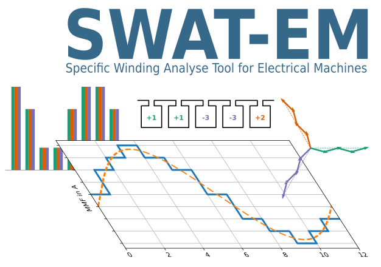

Welcome to SWAT-EM's documentation!
=======================================

SWAT-EM is a software for designing and analyzing winding systems for electrical
machines. Currently supported are rotating field windings (permanent-magnet motors,
induction motors, synchronout reluctance motors) with any number of phases. This can
be distributed full pitch or fractional slot winding or tooth-coil winding.
The design can be done by

- Generating with manual allocation of the coil sides to stator slots
- Defining individual number of turns for each coil
- Automatic winding generators
- Tables of possible winding systems for slot/pole combinations

Analyzing features

- Calculation of the winding factor based on the voltage star of slots
- Plot of the winding layout
- Plot of stator ampere-conductor distribution and the magnetomotive force (MMF)
- Plot of the slot voltage phasors
- Plot of the winding factor
- Max. possible number of parallel circuit connection of coils

There are two ways how to use SWAT-EM:

- Working with the graphical user interface (GUI)
- Working with python-API

Table of Contents
-----------------
.. toctree::
    :maxdepth: 2
    :glob:

    install
    theory

    gui
    api

    reference

Indices and tables
==================

* :ref:`genindex`
* :ref:`modindex`
* :ref:`search`

