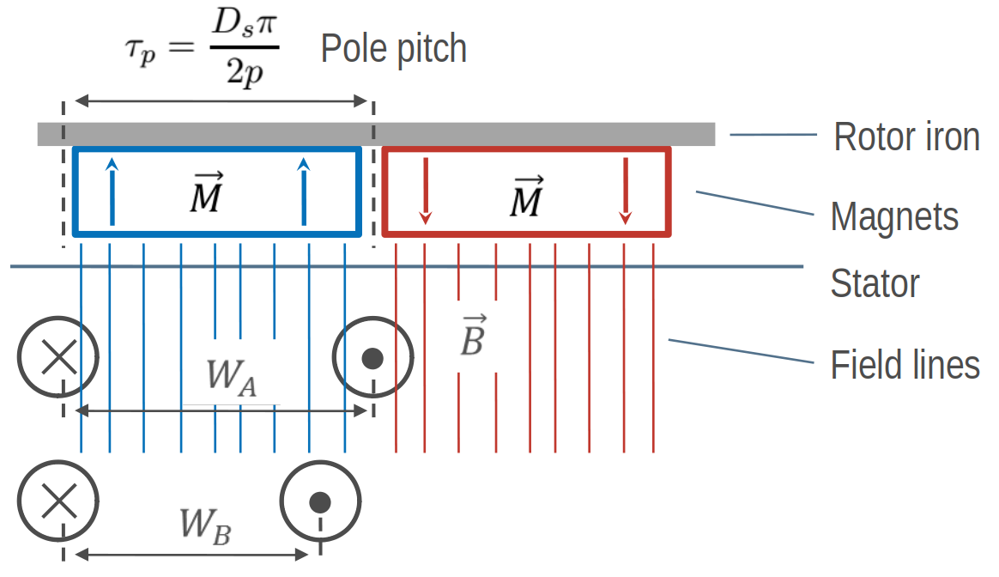
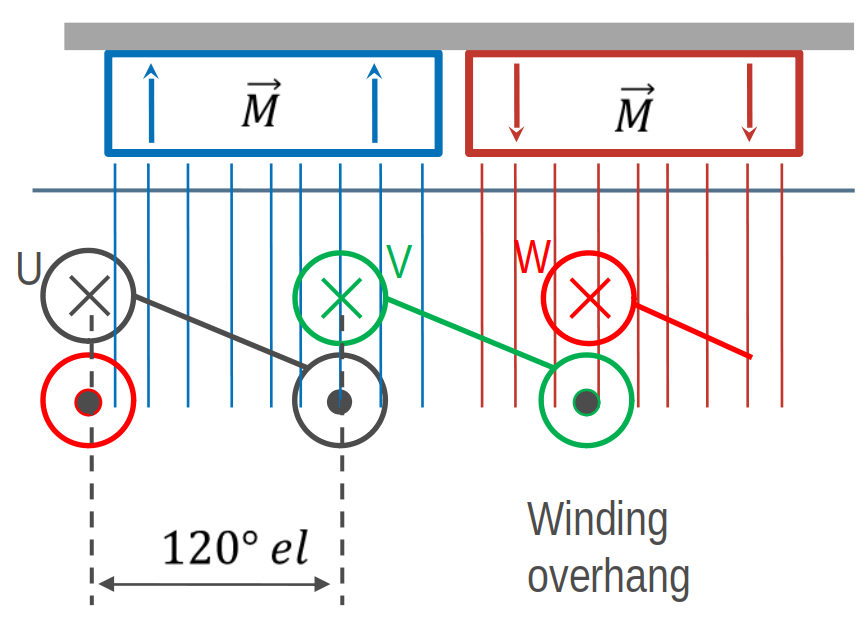
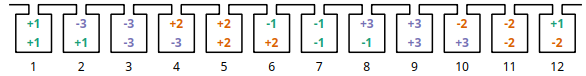
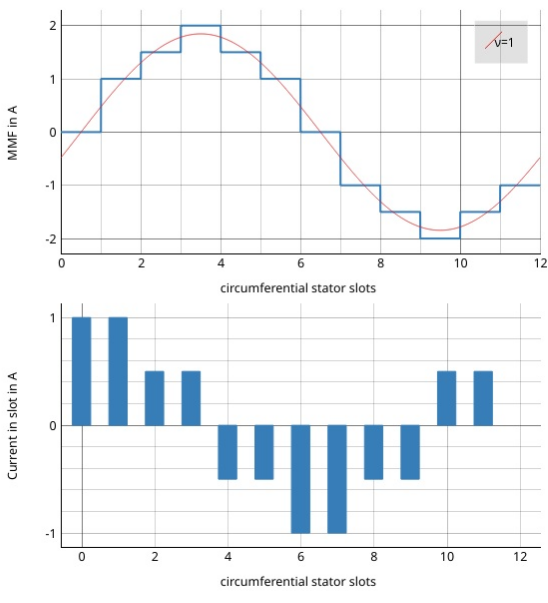

######
Theory
######

************
Introduction
************

Designing, rating and choosing winding systems for electrical machines
is a complicated task. Often some experience is necessary. This indroduction
doesn't replace suitable education or a specialist book about this topic.
This introduction only covers the basics to understand the following explanations.

*************************
Exemplary winding systems
*************************

Simple overlapping winding
==========================

For the beginning let's have a look how we can collect magnetic flux 
generated by a permanent-magnet rotor through a coil. The highest
flux we get, if we define the coil width :math:`W` equal to the
pole pitch :math:`\tau_p`. However this in practise this often isn't 
the best choise because of the high harmonic content. Most windings 
have :math:`W < \tau_p`.

    How to get flux, based on the rotor, through a coil

For a symmetric three-phase winding we have to add two more coil
which are shifted by 120°. For two poles this is one of the most
simplest winding.

.. code-block:: python

    Number of slots:  6
    Number of poles:  2
    Number of phases: 3
    Number of layers: 1
    Winding step    : 3
    Number of slots per pole per phase: 1
    Fundamental winding factor: 1.0, 1.0, 1.0

.. figure:: fig/winding_sketch_overlapping.png
    :width: 300
    :alt: Alternative text
    :figclass: align-center

    Overlapping winding with 6 slots, 2 poles and 3 phases

.. figure:: fig/overlapping_6_2.png
    :width: 500
    :alt: Alternative text
    :figclass: align-center

    Generated overlapping winding

Simple tooth-coil winding
=========================

Besides of the overlapping winding there is another winding winding
systems - tooth coils. To get such a winding the winding step 
must be exactely :math:`W=1`. This means, that the distance between a
wire and its reverse wire is one slot.

    Tooth-coil winding with 3 slots, 2 poles and 3 phases

We can set the winding step explicite with the keyword 'stepwidth'. 
Compared to the overlapping winding we need only 3 slots for
the two poles. To get a coil around every tooth, we need two 
winding layers:

.. code-block:: python

    Number of slots:  3
    Number of poles:  2
    Number of phases: 3
    Number of layers: 1
    Winding step    : 1
    Number of slots per pole per phase: 1/2
    Fundamental winding factor: 0.866, 0.866, 0.866

.. figure:: fig/toothcoil_3_2.png
    :alt: Alternative text
    :figclass: align-center

    Winding layout with 3 slots, 2 poles and 3 phases

A more complex winding
======================

A more complex winding (overlapping full pitch winding with coil shortening)

.. code-block:: python

    Number of slots:  12
    Number of poles:  2
    Number of phases: 3
    Number of layers: 2
    Winding step    : 5
    Number of slots per pole per phase: 2
    Fundamental winding factor: 0.933, 0.933, 0.933

    Winding layout with 12 slots, 2 poles and 3 phases

*********************
Evaluation parameters
*********************

Winding factor
==============

The winding factor :math:`k_w` describes the coupling of the winding with the existing field in the stator. It depends on the ordinal number :math:`\nu` (electrical or mechanical ordinal number possible). There are many methods for calculating the winding factor, for example from the MMF \ref{sec:MMF}.

Unfortunately there are limitations of this method because for three-phase windings the factor :math:`k_{w3}` can't be determined. Further calculation methods derives specific equations based on the winding zones. However theses equation are not universal, so there are many equations for different winding systems. To be general SWAT-EM uses the phasors of the star of slots. The absolute value of the winding factor is defined by

:math:`|k_{w}| = \frac{|\sum{E_i}|}{ \sum{| E_{i} |} }`

and for all harmonics with

:math:`|k_{w,\nu}| = \frac{|\sum{E_{i,\nu}}|}{ \sum{| E_{i,\nu} |} }`

The winding factor gets the maximum value of 1 if all phasors of a phase have the same phase angle. Typically the winding factor is specified with a sign. This indicates the direction of the magnetic field wave, that is generated by the winding in the airgap. SWAT-EM determines the sign by generating the phasors plot for every harmonic number and detecting the sequence of the phases.
The winding factor can referred to the mechanical :math:`\nu` or the electrical :math:`\nu_{el}` ordinal number.

Mechanical harmonics
    This representation is useful to detect all possible rotor pole numbers, which can be combined with the winding. Especially tooth-coil windings have many harmonics and so there are many pole-pairs per winding layout is possible.

Electrical harmonics
    If one have chosen a winding and a number of pole-pairs of the rotor it's a good idea to switch to the electrical ordinal numbers. Here the numbers describes influence of the winding of the waveform of the back-emf for permanent-magnet machines for example. If the winding factor for the harmonics is low, the waveform is more sinusoidal.

Double linked leakage
=====================
It's often a goal to reach a sinusoidal airgap field while designing windings for electrical machines. Harmonics could lead to noise and additional losses. Especially for induction machine there should as little as possible harmonics. The double linked leakage coefficient represents this harmonic content as the ratio of the magnetic energy of harmonics and subharmonics relative to the fundamental. 

:math:`\sigma_d = \dfrac{1}{k_{w1}'^2} \sum_{\nu \neq p}^{\infty} \left( \frac{k_{w\nu}'}{\frac{\nu}{p}} \right)^2`

By default SWAT-EM uses the star of slots for determining the winding factor. For calculating the double linked leakage this isn't useful because for the airgap field is generated by all phases and some of the harmonics cancel each other out. It is preferable to calculate the windingfactor :math:`k_w'` from the MMF.

:math:`k_{w\nu}' = \frac{C_\nu \pi \nu}{3 \sqrt{2} I w}`

where :math:`C_\nu` are the amplitude of the fourier analyses of the MMF, :math:`I` the current amplitude (for MMF plot :math:`I=1A`) and :math:`w` the series number of turns per phase. More about this one can find in :cite:`Gottkehaskamp1` and :cite:`Oberretl1965` for example.

Magnetomotive force (MMF)
=========================

For evaluation of the winding the so called "Magnetomotive force" or short MMF is a useful tool. It is based on the the ampere-conductor distribution. This is shown for time :math:`t=t_1` with respect to the AC current system of :math:`m` phases.

.. _fig:theta_and_MMF:

    Plot of the ampere-conductor distribution and the Magnetomotive force (MMF)

For every slot the winding direction (:math:`d=\pm1`), number of turns :math:`N_c` the current :math:`i` gets summed up 

.. math:: \Theta_{slot} = \sum{d \cdot i N_c}.

Therefor the distribution of ampere-turns is coupled with number of slots. The lower part in figure :ref:`fig:theta_and_MMF` shows this for a winding example with :math:`Q = 12` slots, so there are 12 bars. In reality the distribution has a width per bar which corresponds to the slot opening. However in theory (in this program) the distribution can be interpreted as infinitely thin peaks. The integral of this leads to the MMF

.. math:: MMF(\alpha) = \int_0^{2\pi}{ \Theta d\alpha},

which is shown in upper part in figure :ref:`fig:theta_and_MMF`.
The waveform of the MMF corresponds to the magnetic field, that is generated in the airgap by the winding. For further information consider the literature (eg \cite{hendershot2010design}).

.. bibliography:: literature.bib